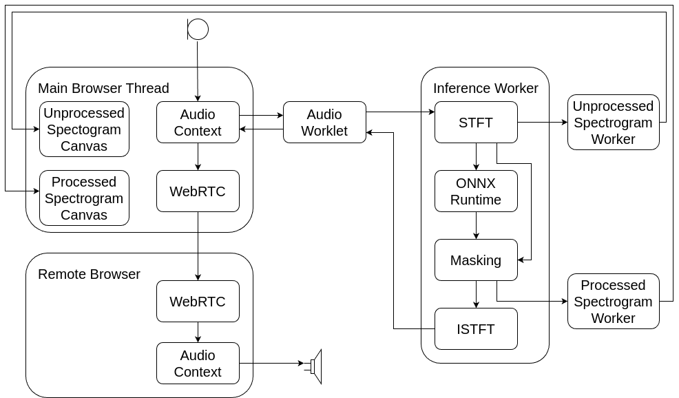

Architecture
============

The server is deliberately thin. Django serves the pages, the model files and the
configs, and a Channels consumer relays signaling messages between everyone in a
room. Audio never reaches it: media flows peer-to-peer over WebRTC, and inference
happens on each client.

Server
------

============================  ==================================================
Component                     Role
============================  ==================================================
Django (``connection`` app)   Rooms, model upload and deletion, page rendering.
Channels + Redis              The signaling WebSocket, one group per room.
daphne                        ASGI server, terminates TLS.
whitenoise                    Serves the static files, including the models.
============================  ==================================================

A ``Room`` holds a name, an optional title and description shown as the page
heading, a default model, and a list of further models the room may switch
between.

The signaling consumer is a plain relay: everything one client sends is
broadcast to the room group, and clients ignore their own messages by client id.
It carries four kinds of traffic — WebRTC offer/answer/candidate exchange, room
membership (``ready``, ``bye``), room-wide model switches, and presenter commands
with the state reports that answer them. The last two are handled independently
of call state, which is why a model can be switched before anyone has pressed
Start.

Client threads
--------------

Three threads share the work, plus two more for drawing.

*The diagram predates the direct-output mode and the reference and preprocessed
spectrogram taps, but the thread structure is unchanged.*

The audio thread
~~~~~~~~~~~~~~~~

``ml-audio-worklet.js`` runs inside the ``AudioContext``, which is fixed at
16 kHz — the rate the whole pipeline is defined at. Web Audio calls it with 128
samples at a time, while models want a hop of 128 or 256, so the worklet
accumulates render quanta until one hop is complete and posts it to the inference
worker over a ``MessageChannel``. For two-input models it posts the microphone
and reference channels together.

Output runs the other way through a FIFO: processed hops arrive as messages and
are pushed into it, and every callback pops exactly 128 samples. When the FIFO is
empty the callback emits silence and counts an underrun rather than blocking —
an ``AudioWorkletProcessor`` that misses its deadline glitches the whole graph.

The inference worker
~~~~~~~~~~~~~~~~~~~~

``ml-inference-worker.js`` owns everything model-related: the analysis and
synthesis filter banks, the preprocessing stages, the ONNX session and the
recurrent state. Per hop it runs the analysis transform, applies the
preprocessing stages, enqueues the frame for the model, applies the model output
according to ``output_mode``, and runs the synthesis transform back to a hop of
samples that it posts to the worklet.

Because the model may work on chunks of several frames while the worklet needs a
result every hop, the enhanced frames come out of a queue. If the queue is empty
when a hop is due — the model is late, or is still filling its first chunk — the
worker falls back to the unenhanced spectrum for that frame. Slow inference
therefore costs enhancement quality, not latency.

The worker also taps up to four spectra per hop and posts them to the spectrogram
workers: microphone, reference, preprocessed and enhanced.

The spectrogram workers
~~~~~~~~~~~~~~~~~~~~~~~

``spec-worker.js`` owns one canvas each through ``OffscreenCanvas``, so drawing
never touches the main thread. Each holds a ring of recent frames as palette
indices and repaints on a timer.

The magnitudes arriving from the inference worker are normalised so that 1.0 is a
full-scale sine, whatever gain the model's frontend carries — the worker measures
this once per model load by pushing a full-scale sine through its own analysis
chain. The display then maps magnitude to colour through a fixed dB window, which
keeps the two panels comparable: an auto-ranging display would defeat the
comparison the demonstrator exists to make.

Where ``OffscreenCanvas`` is unavailable the panels stay blank and the audio path
is unaffected.

The main thread
~~~~~~~~~~~~~~~

``webrtc.js`` builds and owns everything else: capture, the audio graph, the peer
connections, the signaling socket and the interface.

The graph is small. The microphone feeds a gain node and an analyser for the
level meter; the incoming remote audio feeds both the output device and channel 1
of a merger, which is the reference the echo canceller sees. The merger feeds the
worklet, whose output goes to a ``MediaStreamDestination`` and from there into the
peer connection.

Taking the reference *before* the output device is deliberate: it means the
reference does not include the device's own output latency, which is exactly what
the delay calibration measures and compensates.

Model switching
---------------

Switching model builds a new worker and drives it to *ready* without touching the
live pipeline; only then is anything swapped, so a failure leaves the running
session untouched.

Two tiers:

* **Seamless** — same ``hop_size`` and ``inputs``. The running worklet is handed
  a port to the new worker; audio keeps flowing.
* **Rebuild** — anything else. ``hop_size`` and ``inputs`` are fixed when an
  ``AudioWorkletNode`` is constructed, so the node is replaced and spliced back
  into the graph, costing a short gap.

Either way the old worker is asked to dispose and terminated shortly after, the
spectrogram panels are cleared, and everything the page derives from a config is
reapplied.

Peer connections
----------------

Each participant keeps one ``RTCPeerConnection`` per peer, keyed by client id,
with the incoming stream attached both to an audio element and to the reference
channel of the graph. Media is Opus over the browsers' default configuration; the
demonstrator does not tune the transport.

Latency
-------

The end-to-end delay of a round trip is dominated by the transport and the audio
hardware, not by the model. The contribution the pipeline itself makes is covered
in :doc:`signal_processing`.
