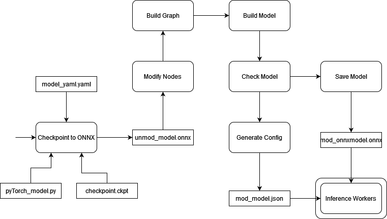

Exporting models from PyTorch
=============================

The demonstrator runs ONNX models frame by frame. A model trained in PyTorch on
whole utterances has to be converted into a form that processes one frame (or a
short chunk) per call and carries its recurrent state explicitly.
``onnx_exporter/`` does that conversion and emits the matching config.

This is not part of the web application and is not needed to run a demo — only
to add a model.

*Rectangular boxes are files, the rest are functions.*

A worked example
----------------

``onnx_exporter/statefull/`` contains a complete, runnable export:

============================  =====================================================
File                          Role
============================  =====================================================
``exporter.py``               The library: finds recurrent nodes and rebuilds graphs.
``example_model.py``          A small frame-wise network, deliberately trivial.
``example_export.py``         The export itself, end to end.
============================  =====================================================

Install what it needs and run it:

.. code-block:: console

   pip install -r onnx_exporter/requirements.txt
   cd onnx_exporter/statefull
   python example_export.py --output example_model

That writes ``example_model.onnx`` and ``example_model.json``, which upload
together under **Manage Models**. It ends by running two frames through the
exported graph with ONNX Runtime, feeding the state of the first into the
second, and reports what it carried forward:

.. code-block:: text

   [export] wrote example_model.onnx
   [export] 1 feature input(s), 1 state tensor(s): [1, 1, 192]
   [export] wrote example_model.json
   [export] ran 2 frames; output (1, 2, 257, 1), 1 state tensor(s) carried forward

``--inputs 2`` produces a two-input model that also takes the far-end reference,
which is what makes echo cancellation possible. ``--n-fft``, ``--hop-size``,
``--win-size`` and ``--pad-size`` set the framing, and must match how the network
was trained.

The example model is not worth listening to — it is untrained, and its
architecture is a placeholder. Its value is that the mechanics around it are
real, so you can confirm the pipeline works before adapting it.

What the export has to produce
------------------------------

Shapes
~~~~~~

The client hands the model one packed spectral frame per feature input:

.. code-block:: text

   (batch, 2, bins, time) = (1, 2, n_fft // 2 + 1 + pad_size, 1)

Channel 0 is the real part, channel 1 the imaginary part. ONNX has no complex
tensors, which is why the spectrum is split this way; a network that uses complex
arithmetic internally has to be rewritten to work on the two halves before it can
be exported at all.

The output has the same layout, without the padding, and is either the enhanced
spectrum (``output_mode: "direct"``) or a mask applied to the input frame
(``output_mode: "mask"``).

Recurrent state
~~~~~~~~~~~~~~~

A network with GRUs or LSTMs holds state between frames. Exported naively, that
state is reinitialised on every call, the model sees each frame in isolation, and
it sounds nothing like the trained system — the difference is visible in
:doc:`validation`.

``example_export.py`` rewrites the exported graph so each recurrent node reads
its initial state from a new graph input and writes its final state to a new
graph output. The inference worker keeps a buffer per state tensor and feeds each
frame's outputs back as the next frame's inputs.

The state shape is read from the node's own recurrence weights, whose last
dimension is the hidden size. Earlier versions of this documentation asked you to
export once, open the file in `Netron <https://netron.app/>`_ and copy the shape
by hand; that step is no longer necessary.

LSTMs carry a cell state as well as a hidden state, so each LSTM node produces
two state tensors rather than one. The script handles both.

Adapting it to your own model
-----------------------------

Most of the work is in ``build_model()``; the rest reads what it needs from the
exported graph.

**Point it at your network.** Import your module instead of
``ExampleEnhancementNet``. It must have a ``forward`` that takes one frame per
feature input and returns one frame, and every dependency it actually uses must
be importable.

**Map the checkpoint keys.** Checkpoints are rarely a bare ``state_dict``, and
the keys rarely match the module's own parameter names — a training framework
usually nests them under a wrapper prefix. This is the step that reliably needs
adapting, and the error messages are unhelpful:

* ``KeyError`` — the key mapping is wrong.
* *Missing keys in state_dict* — add them.
* *Unexpected keys in state_dict* — remove them.

Knowing how the checkpoint was written makes this quick; inferring it from the
errors does not. Print ``checkpoint.keys()`` first.

**Match the framing.** ``--n-fft``, ``--hop-size``, ``--win-size`` and
``--pad-size`` have to be what the network was trained with. ``--hop-size`` must
be a multiple of 128, the Web Audio render quantum.

Version traps
-------------

**Use the TorchScript exporter.** ``example_export.py`` passes
``dynamo=False`` deliberately. PyTorch's newer dynamo exporter produces a graph
this rewriting cannot handle: the recurrence weights arrive through ``Unsqueeze``
nodes rather than as graph initializers, so the state width cannot be read off
them, and the GRU's second output is dropped entirely when the module discards
it. The failure is not subtle — the script stops with a message naming the node.

**Pin the opset.** The rebuilt model carries the opset of the original export.
Left to itself, ``onnx.helper.make_model`` stamps whatever the installed ``onnx``
package considers newest, and ONNX Runtime — in the browser especially — refuses
to load an opset it does not know. The default of 17 is a conservative choice
that current browsers accept.

**Shape and form errors dominate.** Read the ``forward`` method to work out what
the network actually wants; a correct-looking shape can still be rejected.

.. code-block:: text

   RuntimeError: Given groups=1, weight of size [40, 4, 3, 1], expected
   input[1, 2, 528, 1] to have 4 channels, but got 2 channels instead

A near-miss on a single dimension usually means a parameter needs to be larger;
a wrong ``pad_size`` is the classic cause:

.. code-block:: text

   RuntimeError: The size of tensor a (66) must match the size of tensor b (65)
   at non-singleton dimension 2

Checking the result
-------------------

The run-through at the end of the script is the first check: if two frames pass
with the state fed forward, the browser can drive the model the same way.

The second check is the demonstrator itself. Upload the pair, assign it to a
room, and watch the debug panel: *Worker* reaching *Ready* means the config
matches the graph, and a rising *Worker Frames Dropped* means the device cannot
keep up. :doc:`../usage/troubleshooting` covers what the failures look like.
