Validating the JavaScript inference
===================================

The client re-implements the signal processing that surrounds the model — the
filter bank, the framing, the recurrent state handling — in JavaScript. The
question this raises is whether the browser produces the same result as the
PyTorch reference it was ported from.

The comparison below runs the same signal through four paths:

**Full**
   PyTorch, whole file at once. The reference result, and what offline
   evaluation reports.

**Framewise**
   PyTorch, one frame at a time, recurrent state discarded between frames. Shows
   what a naive frame-wise export produces.

**Framewise stateful**
   PyTorch, one frame at a time, recurrent state carried forward — the change
   described in :doc:`exporting_models`.

**Framewise stateful, real-time**
   The JavaScript inference in the browser, running under the real-time
   constraint.

Clean signal
------------

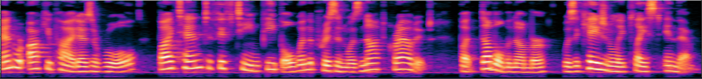

PyTorch, full file:

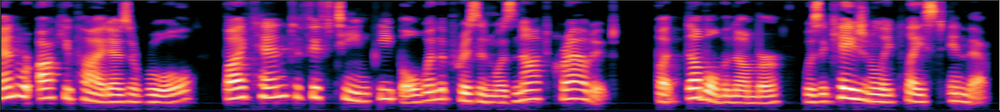

PyTorch, frame-wise without state:

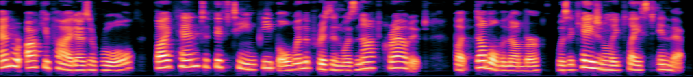

PyTorch, frame-wise with state:

JavaScript, frame-wise with state, real-time:

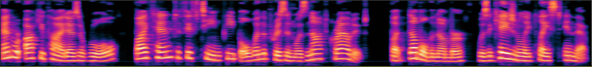

All four leave a clean signal essentially untouched, which is the expected
behaviour and a weak test on its own — it is the noisy case that separates them.

Noisy signal
------------

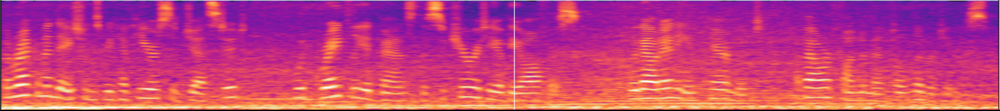

PyTorch, full file — the target result:

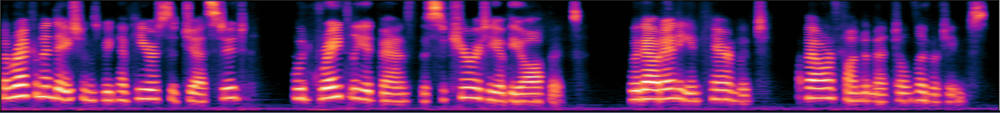

PyTorch, frame-wise without state. The degradation here is the reason the
exporter forwards recurrent state at all:

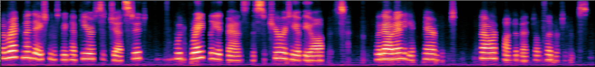

PyTorch, frame-wise with state:

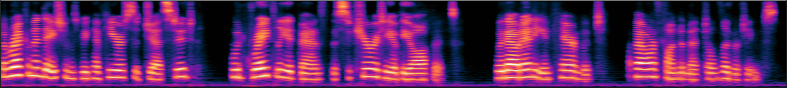

JavaScript, frame-wise with state, real-time:

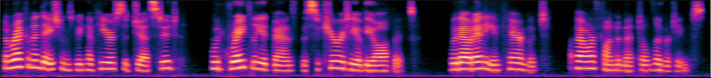

The JavaScript frame-wise stateful inference matches the PyTorch whole-file
result. The port is therefore faithful, and the frame-wise real-time constraint
does not by itself cost enhancement quality.

Processing performance
----------------------

Measured on the development setup, with a hop of 256 samples and a window of 512:

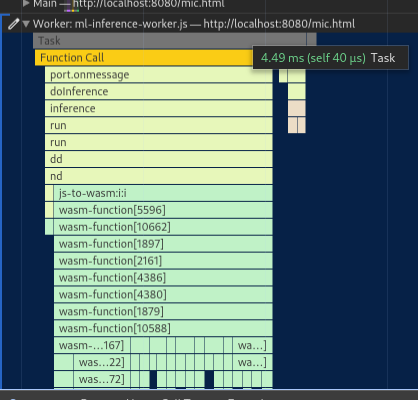

The inference worker processes a frame in 4.49 ms. At 16 kHz a 256-sample hop is
16 ms of audio, so the work fits comfortably inside its budget.

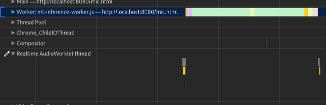

The worklet's buffering overhead is small: 0.13 ms to send a message and 60 µs to
receive one.

These are figures for one machine and one model. What matters in practice is
whether a given device keeps up with a given model, which the *Output Underruns*
and *Worker Frames Dropped* counters in the debug panel report directly.

.. note::

   The delay figures once quoted here for the ``AudioContext`` predate the
   current audio path and the ``latencyHint`` it is constructed with, and have
   not been re-measured. :doc:`signal_processing` gives the pipeline's
   algorithmic delay, which is derived from the framing and measured directly
   from the filter banks.
