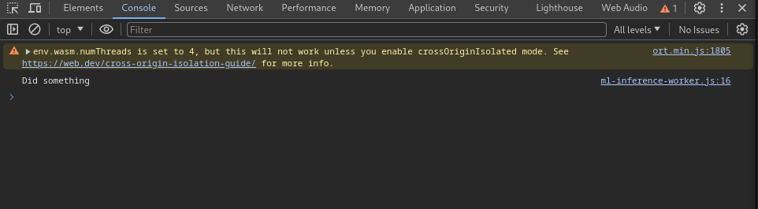
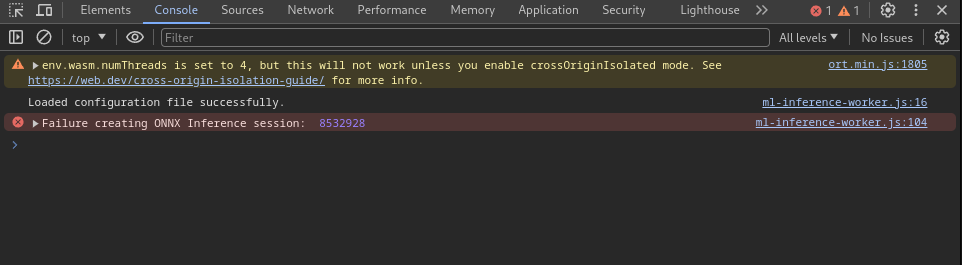
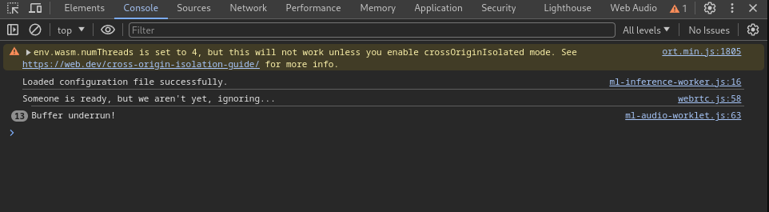
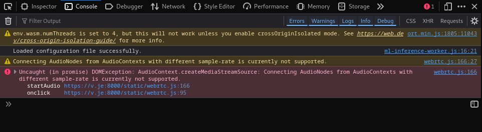

Troubleshooting
===============

Two places report what is wrong: the **Debug / Status Panel** on the room page,
and the browser console (``F12`` → *Console*).

Start does nothing, or the microphone is unavailable
----------------------------------------------------

Check for the warning chip in the page header.

*Insecure origin* means the page was reached over plain ``http://`` at a hostname
or LAN address. Browsers gate ``getUserMedia`` behind a secure context, and
``navigator.mediaDevices`` is not merely restricted but absent. Use ``https://``,
or ``http://localhost`` on the machine itself. The certificate options are
covered in the repository ``README.md``.

Otherwise the browser denied or found no microphone, and the page says which. On
a denial, allow the site in the browser's site settings and press Start again.

The model does not load
-----------------------

An ONNX Runtime error while creating the session means the model could not be
loaded. The messages are rarely informative; the usual cause is a version
mismatch between the JavaScript runtime and the Python exporter, or an operator
the runtime does not implement. The *Worker* row in the debug panel shows
*Error*, and the demo passes audio through unprocessed.

*Failed to inference ONNX model* appears after a successful load, when a call
runs. This is almost always a shape mismatch between the config's
``input_shape`` and what the graph expects. Check the config against the model in
`Netron <https://netron.app/>`_.

Switching model fails
---------------------

The new model is loaded fully before anything is swapped, so a failure leaves the
running session untouched and reports the reason. A model that times out while
loading (30 s) usually means the file is large and the device slow — try it as a
room's default model, where the load happens before Start.

Dropped frames and underruns
----------------------------

*Output Underruns* in the debug panel counts audio callbacks that found no
processed frame waiting and emitted silence instead. *Worker Frames Dropped*
counts frames the worker could not process in time. A handful at startup is
normal; a steadily rising count means the device is not keeping up with real
time.

In order of likelihood:

* **A laptop on battery power.** Performance throttling is the most common cause
  by far. Connect AC power, or raise the performance profile.
* **A model too large for the device.** Try a smaller one, or a larger hop size:
  the per-frame budget scales with it.
* **WASM instead of WebGPU.** The *Model / runtime* section reports the execution
  provider in use. Where WebGPU is unavailable, ONNX Runtime falls back to WASM
  SIMD, which is considerably slower.

Note that a late model result does not stall the audio — the worker substitutes
the unenhanced frame for that hop. Slow inference therefore shows up as lost
enhancement and rising counters, not as growing latency.

Audio quality problems
----------------------

**The enhancement does nothing.** Check that *Enable enhancement* is ticked and
that *Transmission mode* is *Fully processed*. Both are reported in the debug
panel.

**The model underperforms compared to offline results.** Check the input level
first: the meter under the gain slider should reach the target mark while
speaking normally. Models are trained at a particular level, and a quiet handset
is the usual explanation. Check also that the browser's own AGC, AEC and NS are
off — the header shows a warning chip when any of them are active.

**Echo cancellation is ineffective.** The reference must be aligned with the
microphone signal. Run **Measure delay** on that device, in the room where you
are demoing, at the volume you will use. A low reported confidence means the
measurement did not find a clear peak — usually a loudspeaker set too quiet.

**The spectrogram's upper half is empty.** Something upstream is band-limiting
the signal before the pipeline sees it. A Bluetooth headset microphone is the
usual culprit: using it puts the link into the hands-free profile, which carries
16 kHz at best and 8 kHz at worst.

Spectrograms stay blank
-----------------------

The panels need ``OffscreenCanvas``. Where it is missing the console says so on
load, the spectrograms stay blank, and everything else — including the audio
processing — works normally.

Firefox and resampling
----------------------

Older Firefox versions could not open an ``AudioContext`` at 16 kHz, which the
pipeline requires. This is fixed from Firefox 74; the demonstrator supports
current Chromium, Firefox and Safari. See the browser support table in the
repository ``README.md`` for the version floors of each feature.

WebRTC connection problems
--------------------------

Both participants must press Start. A device that has not started ignores the
other's announcement, by design.

For anything deeper, Chromium's WebRTC internals page shows the negotiated
codecs, packet loss and jitter buffer state. Copy and paste this address — it
cannot be linked:

.. code-block:: text

   chrome://webrtc-internals/
